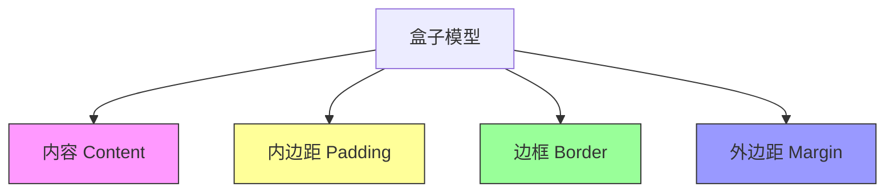
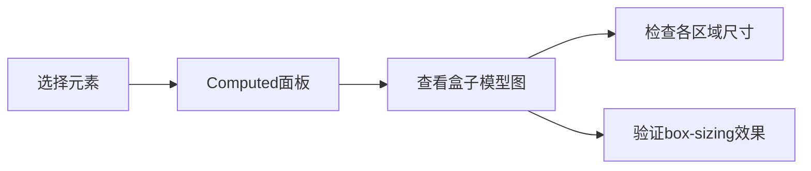

# CSS 盒子模型

## 盒子模型核心概念


---

## 标准盒子模型 vs 替代盒子模型
### 1. 计算方式对比
| 模式                  | width/height 包含范围             | 总宽度计算公式                     |
|-----------------------|----------------------------------|----------------------------------|
| **content-box**       | 仅内容区域                       | width + padding + border + margin|
| **border-box**        | 内容 + padding + border          | 设定width = 内容 + padding + border|

### 2. 可视化对比
```css
/* 标准盒子模型 */
.box-standard {
  box-sizing: content-box;
  width: 300px;
  padding: 20px;
  border: 5px solid black;
  margin: 30px;
  /* 实际占用宽度：300 + 40 + 10 + 60 = 410px */
}

/* 替代盒子模型 */
.box-alternate {
  box-sizing: border-box;
  width: 300px;
  padding: 20px;
  border: 5px solid black;
  margin: 30px;
  /* 实际内容宽度：300 - 40 - 10 = 250px */
}
```

---

## 盒子模型四大部分详解

### 1. 内容区域 (Content)
```css
.content-box {
  width: 200px;      /* 显式设置内容宽度 */
  height: 150px;     /* 显式设置内容高度 */
  min-width: 100px;  /* 最小内容宽度 */
  max-height: 200px; /* 最大内容高度 */
}
```

### 2. 内边距 (Padding)
```css
.padding-example {
  padding: 20px;               /* 四边相同 */
  padding: 10px 20px;          /* 上下 | 左右 */
  padding: 5px 10px 15px 20px; /* 上 右 下 左 */
  
  /* 单边设置 */
  padding-top: 25px;
  padding-inline-end: 15px;    /* 逻辑属性：书写方向末尾 */
}
```

### 3. 边框 (Border)
```css
.border-example {
  border: 3px double #09c; /* 简写 */
  
  /* 分解设置 */
  border-width: 2px 4px;
  border-style: solid dotted;
  border-color: red green;
  
  /* 圆角 */
  border-radius: 10px 20px 30px 40px;
  
  /* 透明边框技巧 */
  border: 10px solid transparent;
}
```

### 4. 外边距 (Margin)
```css
.margin-example {
  margin: auto;        /* 水平居中 */
  margin: 20px -15px;  /* 负边距应用 */
  
  /* 外边距折叠现象 */
  margin-top: 30px;
  margin-bottom: 50px; /* 实际间距50px */
}
```

---

## 高级应用技巧

### 1. 负边距布局
```css
/* 双栏等高布局 */
.container {
  overflow: hidden; /* 触发BFC */
}

.left-col {
  float: left;
  width: 50%;
  margin-bottom: -9999px;
  padding-bottom: 9999px;
}

.right-col {
  float: right;
  width: 50%;
  margin-bottom: -9999px;
  padding-bottom: 9999px;
}
```

### 2. 边框绘制技巧
```css
/* 三角形 */
.triangle {
  width: 0;
  height: 0;
  border: 50px solid transparent;
  border-top-color: red;
}

/* 对话框箭头 */
.tooltip::after {
  content: "";
  position: absolute;
  border: 10px solid;
  border-color: transparent #fff transparent transparent;
  left: -20px;
}
```

### 3. 内边距百分比计算
```css
/* 基于父元素宽度计算 */
.aspect-box {
  width: 50%;
  padding-top: 25%; /* 保持 2:1 宽高比 */
  position: relative;
}

.aspect-content {
  position: absolute;
  top: 0;
  left: 0;
  width: 100%;
  height: 100%;
}
```

---

## 现代布局与盒子模型

### 1. Flexbox 布局
```css
.flex-container {
  display: flex;
  gap: 20px;        /* 替代margin的间距方案 */
}

.flex-item {
  flex: 1;          /* 自动分配剩余空间 */
  margin: 0 10px;   /* 与其他元素的间距 */
}
```

### 2. Grid 布局
```css
.grid-container {
  display: grid;
  grid-template-columns: repeat(3, 1fr);
  gap: 30px;        /* 行列间距 */
  padding: 20px;    /* 容器内边距 */
}

.grid-item {
  margin: 0;        /* 重置默认边距 */
}
```

### 3. 多列布局
```css
.multi-col {
  column-count: 3;
  column-gap: 2em;  /* 替代margin的列间距 */
  padding: 1em;
}
```

---

## 调试与可视化

### 1. 开发者工具调试


### 2. 轮廓调试法
```css
* {
  outline: 1px solid rgba(255,0,0,0.1);
}
```

### 3. 尺寸计算辅助
```javascript
// 获取元素总宽度
function getTotalWidth(element) {
  const style = window.getComputedStyle(element);
  return [
    parseFloat(style.width),
    parseFloat(style.paddingLeft) + parseFloat(style.paddingRight),
    parseFloat(style.borderLeftWidth) + parseFloat(style.borderRightWidth),
    parseFloat(style.marginLeft) + parseFloat(style.marginRight)
  ].reduce((a, b) => a + b);
}
```

---

## 性能优化策略

### 1. 减少布局抖动
```javascript
// 错误方式：强制同步布局
const elements = document.querySelectorAll('.item');
elements.forEach(el => {
  const width = el.offsetWidth; // 触发布局
  el.style.width = width + 10 + 'px'; // 再次布局
});

// 正确方式：批量读取和写入
const widths = [];
elements.forEach(el => widths.push(el.offsetWidth));
elements.forEach((el, i) => el.style.width = widths[i] + 10 + 'px');
```

### 2. 优化渲染路径
```css
/* 使用transform替代边距动画 */
.box {
  transition: transform 0.3s;
}

.box:hover {
  transform: translateX(10px);
}
```

### 3. 合理使用contain属性
```css
.widget {
  contain: layout paint; /* 限制布局影响范围 */
}
```

---

## 最佳实践总结

### 全局设置
```css
/* 所有元素使用border-box模型 */
*, *::before, *::after {
  box-sizing: border-box;
}
```

### 响应式策略
```css
.container {
  width: min(100% - 2rem, 1200px); /* 现代宽度限制 */
  margin-inline: auto;            /* 逻辑属性居中 */
}
```

### 间距系统
```css
/* 使用CSS变量统一间距 */
:root {
  --space-unit: 1rem;
  --space-xs: calc(0.25 * var(--space-unit));
  --space-sm: calc(0.5 * var(--space-unit));
  --space-md: var(--space-unit);
}

.card {
  padding: var(--space-md);
  margin-bottom: var(--space-sm);
}
```

---

## 常见问题解决方案

### 问题：外边距折叠
**现象**：相邻元素的上下边距合并  
**解决方案**：
```css
/* 方法1：使用padding代替 */
.container {
  padding: 20px 0;
}

/* 方法2：创建BFC */
.parent {
  overflow: auto;
}

/* 方法3：使用透明边框 */
.element {
  border-top: 1px solid transparent;
}
```

### 问题：百分比尺寸混乱
**原因**：百分比基于包含块宽度  
**解决方案**：
```css
.aspect-ratio-box {
  position: relative;
  width: 100%;
  padding-top: 56.25%; /* 16:9 比例 */
}

.content {
  position: absolute;
  top: 0;
  left: 0;
  width: 100%;
  height: 100%;
}
```

### 问题：边框影响布局
**解决方案**：
```css
/* 使用outline代替边框进行调试 */
.debug {
  outline: 2px solid red;
}

/* 或通过box-shadow实现无布局影响的边框 */
.shadow-border {
  box-shadow: 0 0 0 2px #09c;
}
```

---

## 现代CSS新特性

### 1. 逻辑属性
```css
.international-box {
  margin-inline-start: 2rem;  /* 根据书写方向调整 */
  padding-block-end: 1rem;    /* 块级方向内边距 */
}
```

### 2. 容器查询
```css
@container (width > 600px) {
  .card {
    padding: 2rem;
  }
}
```

### 3. 嵌套模型
```css
.box {
  width: 100%;
  @media (width >= 768px) {
    width: 50%;
  }
}
```