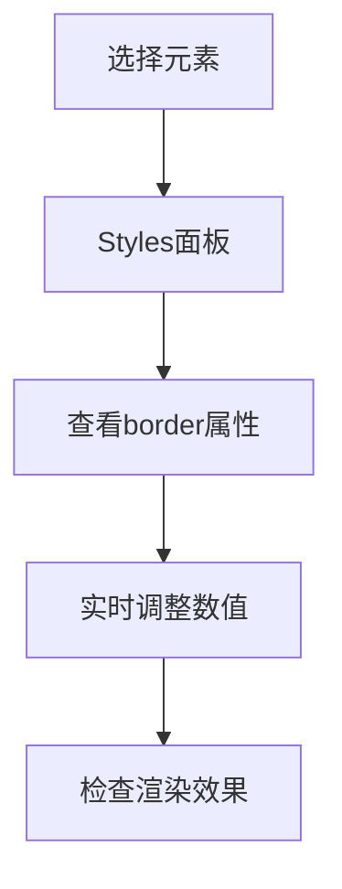

# CSS 边框

## 边框属性总览
| 属性                  | 作用                          | 可选值示例                |
|-----------------------|-------------------------------|--------------------------|
| `border-style`        | 定义边框样式                  | `solid`, `dotted`, `double` |
| `border-width`        | 设置边框宽度                  | `1px`, `medium`, `thick` |
| `border-color`        | 设置边框颜色                  | `#ff0000`, `rgba(0,0,0,0.5)` |
| `border-radius`       | 定义圆角半径                  | `5px`, `50%`             |
| `border-image`        | 使用图像作为边框              | `url(border.png) 30 round` |
| `box-shadow`          | 添加阴影效果                  | `2px 2px 5px #000`       |
| `outline`             | 外轮廓（不影响布局）          | `3px solid red`          |

---

## 基础边框控制

### 1. 基本语法
```css
/* 完整写法 */
.element {
  border-width: 2px;
  border-style: solid;
  border-color: #09c;
}

/* 简写形式 */
.element {
  border: 2px solid #09c; /* 顺序：width style color */
}

/* 单边设置 */
.element {
  border-top: 3px dashed red;
  border-right: 1px groove #fff;
  border-bottom: 0;
  border-left-style: dotted;
}
```

### 2. 边框样式类型
```css
.border-demo {
  border-style: solid;     /* 实线 */
  border-style: dotted;    /* 点状 */
  border-style: dashed;    /* 虚线 */
  border-style: double;    /* 双线（至少3px宽度） */
  border-style: groove;    /* 3D凹槽 */
  border-style: ridge;     /* 3D凸起 */
  border-style: inset;     /* 内嵌效果 */
  border-style: outset;    /* 外凸效果 */
}
```

### 3. 圆角控制
```css
.rounded {
  border-radius: 10px;             /* 统一圆角 */
  border-radius: 10px 20px;       /* 左上/右下 右上/左下 */
  border-radius: 5px 10px 15px 20px; /* 单独设置每个角 */
  border-top-left-radius: 50% 30px; /* 椭圆圆角 */
}
```

---

## 高级边框技巧

### 1. 边框图像
```css
.image-border {
  border: 30px solid transparent;
  border-image: url('border.png') 30 round;
  
  /* 分解写法 */
  border-image-source: url('border.png');
  border-image-slice: 30;
  border-image-width: 30px;
  border-image-repeat: round;
}
```

### 2. 阴影边框
```css
.shadow-border {
  box-shadow: 
    0 0 0 2px #09c,    /* 第一层：实线边框效果 */
    2px 2px 5px rgba(0,0,0,0.3); /* 第二层：投影 */
}

/* 镂空效果 */
.hollow-border {
  box-shadow: inset 0 0 0 2px #09c;
}
```

### 3. 渐变边框
```css
.gradient-border {
  border: 2px solid transparent;
  background: 
    linear-gradient(white, white) padding-box,
    linear-gradient(45deg, #ff6b6b, #4ecdc4) border-box;
}
```

---

## 实用案例集合

### 案例1：三角形绘制
```css
.triangle {
  width: 0;
  height: 0;
  border: 50px solid transparent;
  border-top-color: red;      /* 向上箭头 */
  border-bottom: none;
}

/* 向右箭头 */
.arrow-right {
  border-left: 30px solid #09c;
  border-top: 20px solid transparent;
  border-bottom: 20px solid transparent;
}
```

### 案例2：对话框气泡
```css
.chat-bubble {
  position: relative;
  background: #fff;
  border: 2px solid #09c;
  border-radius: 10px;
  padding: 15px;
}

.chat-bubble::after {
  content: "";
  position: absolute;
  left: -20px;
  top: 50%;
  transform: translateY(-50%);
  border: 10px solid;
  border-color: transparent #fff transparent transparent;
}
```

### 案例3：图片边框相框
```css
.photo-frame {
  padding: 10px;
  background: 
    linear-gradient(45deg, #f3ec78, #af4261),
    linear-gradient(45deg, #f3ec78, #af4261);
  background-clip: content-box, border-box;
  border: 5px solid transparent;
}
```

---

## 性能优化策略

### 1. 硬件加速
```css
.animated-border {
  will-change: border-color; /* 提示浏览器优化 */
  transition: border-color 0.3s;
}
```

### 2. 复合层优化
```css
/* 使用transform代替box-shadow动画 */
.box {
  transition: transform 0.3s;
}

.box:hover {
  transform: translateZ(0) scale(1.05);
}
```

### 3. 边框替代方案
```css
/* 使用伪元素实现复杂边框 */
.pseudo-border::before {
  content: "";
  position: absolute;
  inset: -5px;
  border: 2px solid #09c;
  border-radius: 15px;
}
```

---

## 浏览器兼容性方案

### 1. 渐进增强
```css
.gradient-border {
  border: 2px solid #09c; /* 回退方案 */
}

@supports (background-clip: padding-box) {
  .gradient-border {
    border-color: transparent;
    background-clip: padding-box, border-box;
  }
}
```

### 2. 前缀处理
```css
.border-radius {
  -webkit-border-radius: 10px; /* 旧版iOS支持 */
          border-radius: 10px;
}
```

---

## 调试与可视化

### 1. 边框层级调试
```css
* {
  border: 1px solid rgba(255,0,0,0.1); /* 可视化所有元素边框 */
}
```

### 2. 浏览器工具检测


---

## 最佳实践总结

### 全局设置
```css
/* 统一边框过渡效果 */
* {
  transition: border-color 0.2s ease;
}
```

### 响应式策略
```css
.card {
  border: 2px solid #eee;
}

@media (prefers-color-scheme: dark) {
  .card {
    border-color: #444;
  }
}
```

### 变量控制
```css
:root {
  --primary-border: 2px solid #09c;
  --radius-sm: 4px;
}

.form-input {
  border: var(--primary-border);
  border-radius: var(--radius-sm);
}
```

---

## 常见问题解决方案

### 问题1：边框重叠
```css
/* 使用负边距抵消 */
.grid-item {
  border-right: 1px solid #ddd;
  margin-right: -1px;
}
```

### 问题2：圆角溢出
```css
/* 添加overflow: hidden */
.rounded-box {
  border-radius: 20px;
  overflow: hidden;
}
```

### 问题3：边框动画闪烁
```css
/* 启用GPU加速 */
.animated-border {
  transform: translateZ(0);
}
```

---

## 现代CSS新特性

### 1. 逻辑属性
```css
.rtl-border {
  border-inline-start: 2px solid red; /* 根据书写方向自动适配 */
}
```

### 2. 锥形渐变边框
```css
.conic-border {
  border: 5px solid;
  border-image: conic-gradient(red, yellow, lime, aqua, blue, magenta, red) 1;
}
```

### 3. 动态阴影边框
```css
.dynamic-border {
  --border-color: #09c;
  border: 2px solid var(--border-color);
  box-shadow: 0 0 10px var(--border-color);
  transition: --border-color 0.3s;
}
```