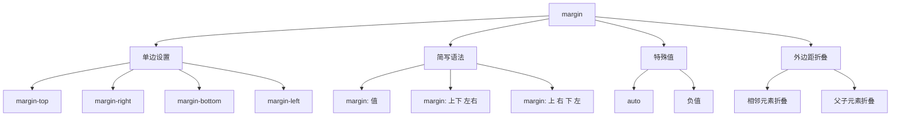

# CSS 外边距 (margin) 

## 核心概念与属性总览


---

## 基础语法与使用

### 1. 基本写法
```css
/* 统一四边 */
.box { margin: 20px; }

/* 上下 | 左右 */
.container { margin: 10px 5%; }

/* 上 | 右 | 下 | 左 */
.element { margin: 5px 10px 15px 20px; }

/* 单边设置 */
.special { 
  margin-top: 2em;
  margin-inline-end: 1rem; /* 逻辑属性 */
}
```

### 2. 特殊值应用
```css
/* 自动居中 */
.center-box {
  width: 600px;
  margin: 0 auto; /* 水平居中 */
}

/* 负边距布局 */
.overlap {
  margin-left: -20px; /* 元素向左溢出 */
}

/* 百分比计算 */
.fluid-margin {
  margin: 5%; /* 基于父容器宽度计算 */
}
```

---

## 外边距折叠详解

### 1. 触发条件
- **相邻元素**：垂直方向相邻块级元素
- **父子元素**：父元素无边框/padding，子元素有 margin-top
- **空元素**：元素内容为空且自身有 margin

### 2. 折叠规则
| 场景                | 结果                     |
|---------------------|--------------------------|
| 20px + 30px         | 取最大值 30px            |
| -15px + 20px        | 相加 5px                |
| 父子元素 margin-top | 合并到父元素外侧         |

### 3. 阻止折叠方案
```css
/* 方法1：添加边框或内边距 */
.parent {
  padding: 1px; /* 最小影响 */
}

/* 方法2：创建BFC */
.container {
  overflow: auto;
}

/* 方法3：使用Flex/Grid布局 */
.modern-layout {
  display: flex;
  flex-direction: column;
  gap: 20px; /* 替代margin */
}
```

---

## 实战应用案例

### 1. 经典居中布局
```css
.page-wrap {
  max-width: 1200px;
  margin: 0 auto; /* 水平居中 */
  padding: 20px;
}
```

### 2. 圣杯布局
```css
.main-content {
  margin: 0 220px; /* 两侧留出边栏空间 */
}

.left-sidebar {
  width: 200px;
  margin-left: -100%; /* 负边距定位 */
}

.right-sidebar {
  width: 200px;
  margin-left: -200px;
}
```

### 3. 响应式间距系统
```css
:root {
  --space-unit: 1rem;
  --space-ratio: 1.5;
}

.mb-1 { margin-bottom: var(--space-unit); }
.mb-2 { margin-bottom: calc(var(--space-unit) * var(--space-ratio)); }

@media (min-width: 768px) {
  .md\:mb-3 { margin-bottom: calc(var(--space-unit) * 2); }
}
```

---

## 现代布局中的 margin

### 1. Flexbox 布局
```css
.flex-container {
  display: flex;
  gap: 20px; /* 替代子元素margin */
}

.flex-item:last-child {
  margin-left: auto; /* 右对齐 */
}
```

### 2. Grid 布局
```css
.grid-container {
  display: grid;
  grid-template-columns: repeat(3, 1fr);
  gap: 30px; /* 替代行列margin */
}

.grid-item {
  margin: 0; /* 重置默认margin */
}
```

### 3. 多列布局
```css
.multi-col {
  column-count: 3;
  margin: 20px 0;
  column-gap: 40px; /* 替代横向margin */
}
```

---

## 性能优化策略

### 1. 减少布局抖动
```javascript
// 错误示例：强制同步布局
const elements = document.querySelectorAll('.item');
elements.forEach(el => {
  const width = el.offsetWidth;
  el.style.marginRight = width > 100 ? '10px' : '5px';
});

// 正确做法：批量读取和写入
const measurements = [];
elements.forEach(el => measurements.push(el.offsetWidth));
elements.forEach((el, i) => {
  el.style.marginRight = measurements[i] > 100 ? '10px' : '5px';
});
```

### 2. 优先使用 transform
```css
/* 避免margin动画 */
.animated-box {
  transition: transform 0.3s;
}

.animated-box:hover {
  transform: translateX(20px); /* 替代margin-left */
}
```

### 3. 合理使用 contain 属性
```css
.widget {
  contain: layout; /* 限制布局影响范围 */
}
```

---

## 常见问题解决方案

### 问题1：margin 不生效
**可能原因**：
- 元素为行内元素（需设置 display）
- 父元素无可用空间（宽度限制）
- 外边距折叠导致意外结果

### 问题2：负边距溢出
```css
/* 解决方案：父容器添加overflow */
.container {
  overflow: hidden; /* 隐藏溢出内容 */
}
```

### 问题3：响应式间距冲突
```css
/* 移动端优先策略 */
.card {
  margin-bottom: 1rem;
}

@media (min-width: 768px) {
  .card {
    margin-bottom: 2rem;
  }
}
```

---

## 高级技巧与新特性

### 1. 逻辑属性
```css
.rtl-box {
  margin-inline-start: 2rem; /* 适配书写方向 */
}
```

### 2. CSS 变量控制
```css
:root {
  --gutter: 20px;
}

.grid-item {
  margin: calc(var(--gutter) / 2);
}
```

### 3. 容器查询适配
```css
@container (width > 600px) {
  .card {
    margin: 2rem;
  }
}
```

---

## 浏览器兼容性指南

| 特性            | Chrome | Firefox | Safari | Edge  |
|-----------------|--------|---------|--------|-------|
| 逻辑属性        | 87+     | 66+     | 14.1+  | 87+   |
| gap 属性        | 84+     | 80+     | 14.1+  | 84+   |
| 容器查询        | 105+    | 110+    | 16.0+  | 105+  |

---

## 最佳实践总结

1. **全局重置**：清除默认外边距
```css
body {
  margin: 0;
}
```

2. **间距系统**：使用 CSS 变量或预处理器管理
3. **现代布局**：优先使用 Flex/Grid 的 gap 属性
4. **响应式策略**：使用媒体查询分段控制
5. **性能监测**：通过 DevTools Performance 面板分析布局变化