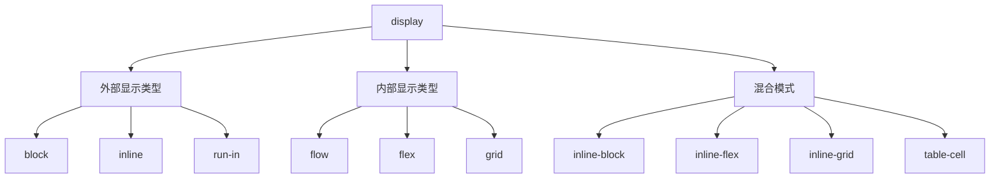

# CSS Display 属性

## 核心概念与属性总览


---

## 基础显示模式详解

### 1. 基础显示类型
| 值            | 表现特性                      | 典型应用场景            |
|---------------|------------------------------|-------------------------|
| `block`       | 独占一行，可设置宽高          | div、p、section         |
| `inline`      | 行内排列，不可设宽高          | span、a、strong         |
| `inline-block`| 行内排列，可设宽高            | 导航项、图标容器        |
| `none`        | 完全隐藏，不占空间            | 动态切换显示状态        |

### 2. 代码示例
```html
<!-- 基础布局示例 -->
<div class="block">块级元素</div>
<span class="inline">行内元素</span>
<div class="inline-block">行内块元素</div>
```

```css
.block {
  display: block;
  width: 200px;
  height: 50px;
  background: #f0f;
}

.inline {
  display: inline;
  /* width/height 无效 */
  padding: 5px;
  background: #0ff;
}

.inline-block {
  display: inline-block;
  width: 100px;
  height: 30px;
  background: #ff0;
}
```

---

## 现代布局模式

### 1. Flexbox 弹性布局
```css
.flex-container {
  display: flex;
  gap: 20px;
  justify-content: space-between;
  align-items: center;
}

.flex-item {
  flex: 1 0 200px;
}
```

### 2. Grid 网格布局
```css
.grid-container {
  display: grid;
  grid-template-columns: repeat(auto-fit, minmax(300px, 1fr));
  grid-gap: 1rem;
}

.grid-item {
  grid-column: span 2;
}
```

### 3. 多列布局
```css
.multi-col {
  display: flow-root; /* 创建BFC */
  column-count: 3;
  column-gap: 2em;
}
```

---

## 特殊显示模式

### 1. 表格布局
```css
.table-wrapper {
  display: table;
  width: 100%;
}

.table-row {
  display: table-row;
}

.table-cell {
  display: table-cell;
  vertical-align: middle;
}
```

### 2. 列表项显示
```css
.custom-list {
  display: list-item;
  list-style-type: "▶";
  padding-left: 1em;
}
```

### 3. 内容可见性优化
```css
.lazy-load {
  content-visibility: auto;
  contain-intrinsic-size: 0 500px;
}
```

---

## 响应式显示控制

### 1. 媒体查询切换
```css
.mobile-menu {
  display: none;
}

@media (max-width: 768px) {
  .desktop-nav {
    display: none;
  }
  
  .mobile-menu {
    display: block;
  }
}
```

### 2. 容器查询适配
```css
@container (width > 600px) {
  .card {
    display: grid;
    grid-template-columns: 1fr 2fr;
  }
}
```

### 3. 暗黑模式适配
```css
@media (prefers-color-scheme: dark) {
  .theme-switch {
    display: inline-flex;
  }
}
```

---

## 高级应用技巧

### 1. 复合显示模式
```css
.complex-layout {
  display: grid;
}

.complex-layout > .ad-area {
  display: contents; /* 内容提升到父级网格 */
}
```

### 2. 动画切换显示
```css
.modal {
  display: grid;
  opacity: 0;
  transition: opacity 0.3s;
}

.modal.active {
  opacity: 1;
}
```

### 3. 打印优化
```css
@media print {
  .no-print {
    display: none !important;
  }
  
  .page-break {
    display: block;
    page-break-before: always;
  }
}
```

---

## 最佳实践与规范

### 1. 现代布局优先级
```markdown
1. Grid → 二维复杂布局
2. Flexbox → 一维布局
3. inline-block → 简单行内布局
4. float → 遗留系统维护
```

### 2. 性能优化建议
- 避免深层嵌套的 `display: table`
- 使用 `contain: layout` 限制布局影响范围
- 优先使用 CSS 动画替代 `display` 切换

### 3. 可访问性指南
```html
<!-- 正确隐藏元素 -->
<div hidden aria-hidden="true">不可见内容</div>
<div class="visually-hidden">屏幕阅读器可见</div>

<style>
.visually-hidden {
  position: absolute;
  width: 1px;
  height: 1px;
  clip: rect(0 0 0 0);
  overflow: hidden;
}
</style>
```

---

## 浏览器兼容性方案

### 1. Flexbox 前缀处理
```css
.legacy-flex {
  display: -webkit-box;
  display: -ms-flexbox;
  display: flex;
  -webkit-box-pack: justify;
      -ms-flex-pack: justify;
          justify-content: space-between;
}
```

### 2. Grid 渐进增强
```css
.grid-fallback {
  display: flex;
  flex-wrap: wrap;
}

@supports (display: grid) {
  .grid-fallback {
    display: grid;
    grid-template-columns: repeat(3, 1fr);
  }
}
```

---

## 常见问题解决方案

### 问题1：inline-block 间距
```html
<!-- 原始写法产生间隙 -->
<div class="inline-block"></div>
<div class="inline-block"></div>

<!-- 解决方案 -->
<div class="inline-block"></div><!--
--><div class="inline-block"></div>
```

```css
/* 或通过CSS移除 */
.inline-block {
  margin-right: -4px;
}
```

### 问题2：Flex 等高布局
```css
.flex-equal {
  display: flex;
  align-items: stretch; /* 默认值 */
}

.flex-item {
  height: auto; /* 自动撑满 */
}
```

### 问题3：Grid 自动填充
```css
.auto-grid {
  display: grid;
  grid-template-columns: repeat(auto-fill, minmax(200px, 1fr));
}
```

---

## 现代 CSS 新特性

### 1. 子网格布局
```css
.grid-container {
  display: grid;
  grid-template-columns: subgrid; /* 继承父网格轨道 */
}
```

### 2. 容器查询显示控制
```css
@container (width > 800px) {
  .component {
    display: flex;
  }
}
```

### 3. 逻辑属性适配
```css
.rtl-layout {
  display: inline-flex;
  direction: rtl;
}
```