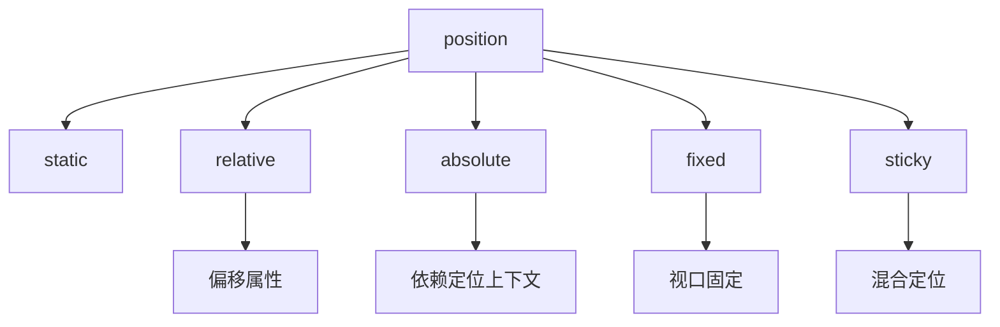

# CSS 定位

## 定位属性总览


---

## 核心定位类型详解

### 1. 基础定位类型
| 值            | 文档流影响                  | 定位基准                  | z-index生效 |
|---------------|---------------------------|--------------------------|------------|
| `static`      | 正常流 (默认)              | 无                        | 否         |
| `relative`    | 保留原空间                 | 自身原始位置              | 是         |
| `absolute`    | 脱离文档流                | 最近非static定位祖先       | 是         |
| `fixed`       | 脱离文档流                | 视口                      | 是         |
| `sticky`      | 混合定位                  | 最近滚动容器               | 是         |

### 2. 偏移属性
```css
.box {
  top: 20px;      /* 向下偏移 */
  right: 5%;      /* 向左偏移 */
  bottom: -10px;  /* 向上偏移 */
  left: 50%;      /* 向右偏移 */
}
```

---

## 实战定位技巧

### 1. 绝对定位居中
```css
.modal {
  position: absolute;
  left: 50%;
  top: 50%;
  transform: translate(-50%, -50%);
  /* 替代方案 */
  /* inset: 0; margin: auto; */
}
```

### 2. 粘性导航栏
```css
.navbar {
  position: sticky;
  top: 0;
  backdrop-filter: blur(10px);
  z-index: 1000;
}
```

### 3. 视差滚动效果
```css
.parallax {
  position: fixed;
  width: 100%;
  height: 100vh;
  transform: translateZ(-1px) scale(2);
}
```

---

## 高级定位策略

### 1. 层叠上下文控制
```css
.modal-overlay {
  position: fixed;
  z-index: 1000; /* 创建新层叠上下文 */
}

.modal-content {
  position: relative;
  z-index: 1001;
}
```

### 2. 定位上下文优化
```css
.card {
  position: relative; /* 创建定位上下文 */
  
  .badge {
    position: absolute;
    top: -10px;
    right: -10px;
  }
}
```

### 3. 粘性定位限制
```css
.sticky-footer {
  position: sticky;
  bottom: 0;
  /* 父容器需满足：
     1. 高度大于元素高度
     2. 允许滚动 */
}
```

---

## 定位与布局整合

### 1. 结合 Flexbox
```css
.flex-container {
  display: flex;
  position: relative;
  
  .absolute-item {
    position: absolute;
    right: 0;
  }
}
```

### 2. 结合 Grid
```css
.grid-container {
  display: grid;
  position: relative;
  
  .sticky-item {
    position: sticky;
    top: 20px;
    grid-column: 1 / -1;
  }
}
```

### 3. 多级定位系统
```css
.level1 { position: relative; z-index: 1; }
.level2 { position: absolute; z-index: 2; }
.level3 { position: fixed; z-index: 3; }
```

---

## 性能优化方案

### 1. 硬件加速
```css
.optimized {
  will-change: transform; /* 提示浏览器优化 */
  transform: translateZ(0);
}
```

### 2. 避免重绘抖动
```css
/* 错误示例 */
.animate-left {
  transition: left 0.3s;
}

/* 正确方式 */
.animate-transform {
  transition: transform 0.3s;
  transform: translateX(var(--pos));
}
```

### 3. 内容可见性优化
```css
.lazy-section {
  content-visibility: auto;
  contain-intrinsic-size: 0 500px;
}
```

---

## 最佳实践规范

### 1. 定位使用优先级
```markdown
1. `sticky` → 滚动吸附
2. `relative` → 创建定位上下文
3. `absolute` → 精准控制位置
4. `fixed` → 全屏悬浮元素
```

### 2. 可访问性指南
```html
<!-- 模态框焦点管理 -->
<div role="dialog" aria-modal="true">
  <button class="close-button">×</button>
</div>
```

### 3. 响应式策略
```css
@media (max-width: 768px) {
  .desktop-only {
    position: absolute;
    visibility: hidden;
  }
}
```

---

## 浏览器兼容方案

### 1. Sticky 定位 Polyfill
```html
<script src="stickyfill.min.js"></script>
<script>
  Stickyfill.add(document.querySelector('.sticky-element'));
</script>
```

### 2. 固定定位降级
```css
.fixed-fallback {
  position: absolute;
}

@supports (position: fixed) {
  .fixed-fallback {
    position: fixed;
  }
}
```

### 3. 兼容性速查表
| 定位类型  | Chrome | Firefox | Safari | Edge  |
|----------|--------|---------|--------|-------|
| sticky   | 56+     | 32+     | 13+    | 16+   |
| absolute | 1+      | 1+      | 1+     | 12+   |
| fixed    | 1+      | 1+      | 1+     | 12+   |

---

## 常见问题解决方案

### 问题1：z-index 失效
```css
.parent {
  position: relative;
  z-index: 1; /* 创建层叠上下文 */
}

.child {
  z-index: 9999; /* 在父级上下文中生效 */
}
```

### 问题2：固定定位抖动
```css
.fixed-element {
  backface-visibility: hidden; /* 启用硬件加速 */
}
```

### 问题3：粘性定位不生效
```markdown
检查条件：
1. 父容器允许滚动 (overflow ≠ visible)
2. 指定至少一个偏移值 (top/bottom)
3. 父容器高度足够容纳元素
```

---

## 现代 CSS 新特性

### 1. 逻辑定位属性
```css
.rtl-element {
  inset-inline-start: 20px; /* 适配书写方向 */
}
```

### 2. 锚点定位 (CSS Anchor Positioning)
```css
.tooltip {
  position: absolute;
  anchor-name: --target;
}

.popup {
  position: fixed;
  top: anchor(--target bottom);
  left: anchor(--target right);
}
```

### 3. 层叠层控制
```css
@layer components {
  .modal {
    position: fixed;
    z-index: 1000;
  }
}
```