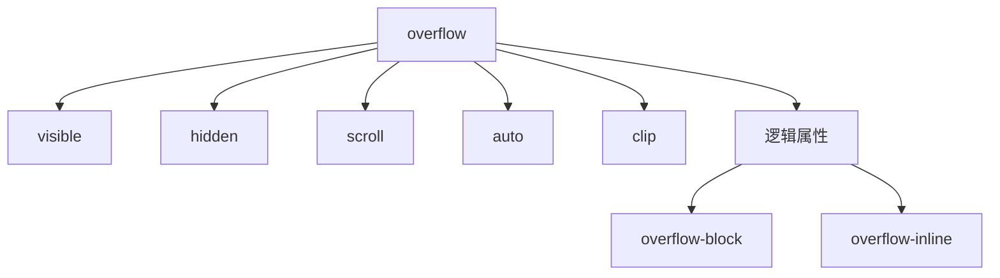

# CSS Overflow

## 核心属性总览


---

## 基础属性解析

### 1. 基础值类型
| 值          | 表现特性                      | 典型应用场景            |
|-------------|------------------------------|-------------------------|
| `visible`   | 内容溢出容器（默认）          | 允许内容自然溢出        |
| `hidden`    | 裁剪溢出内容                  | 创建视差效果/隐藏内容   |
| `scroll`    | 强制显示滚动条                | 确保布局稳定            |
| `auto`      | 按需显示滚动条                | 响应式容器              |
| `clip`      | 严格裁剪（CSS3）              | 无障碍优化              |

### 2. 分轴控制
```css
.scroll-container {
  overflow-x: auto;    /* 水平滚动 */
  overflow-y: hidden;  /* 垂直裁剪 */
  
  /* 简写形式 */
  overflow: hidden auto;
}
```

---

## 高级滚动控制

### 1. 自定义滚动条
```css
/* WebKit 浏览器 */
::-webkit-scrollbar {
  width: 8px;
  background: #f1f1f1;
}

::-webkit-scrollbar-thumb {
  background: #888;
  border-radius: 4px;
}

/* Firefox */
scrollbar-color: #888 #f1f1f1;
scrollbar-width: thin;
```

### 2. 滚动行为控制
```css
.smooth-scroll {
  scroll-behavior: smooth;  /* 平滑滚动 */
  overscroll-behavior: contain; /* 阻止滚动链 */
}
```

### 3. 滚动捕捉（CSS Scroll Snap）
```css
.slider {
  overflow-x: auto;
  scroll-snap-type: x mandatory;
}

.slide {
  scroll-snap-align: start;
  flex: 0 0 100%;
}
```

---

## 实用案例集合

### 案例1：模态框锁定背景
```css
body.modal-open {
  overflow: hidden; /* 禁用页面滚动 */
  padding-right: 15px; /* 补偿滚动条宽度 */
}

.modal {
  overflow: auto; /* 允许模态框内部滚动 */
}
```

### 案例2：水平滚动导航
```css
.nav-scroll {
  overflow-x: auto;
  white-space: nowrap;
  -webkit-overflow-scrolling: touch;
  
  /* 隐藏滚动条 */
  scrollbar-width: none; /* Firefox */
  &::-webkit-scrollbar { display: none; }
}
```

### 案例3：文本溢出处理
```css
.ellipsis {
  overflow: hidden;
  white-space: nowrap;
  text-overflow: ellipsis;
  
  /* 多行省略 */
  display: -webkit-box;
  -webkit-line-clamp: 3;
  -webkit-box-orient: vertical;
}
```

---

## 性能优化策略

### 1. 硬件加速优化
```css
.scroll-area {
  transform: translateZ(0); /* 启用GPU加速 */
  will-change: scroll-position;
}
```

### 2. 内容可见性优化
```css
.lazy-scroll {
  content-visibility: auto;
  contain-intrinsic-size: 0 500px;
}
```

### 3. 滚动事件优化
```javascript
// 使用防抖/节流
let ticking = false;
window.addEventListener('scroll', () => {
  if (!ticking) {
    requestAnimationFrame(() => {
      // 处理逻辑
      ticking = false;
    });
    ticking = true;
  }
});
```

---

## 最佳实践规范

### 1. 响应式策略
```css
@media (hover: none) {
  .touch-scroll {
    -webkit-overflow-scrolling: touch;
  }
}
```

### 2. 可访问性指南
```html
<div role="region" aria-label="Gallery" tabindex="0">
  <!-- 可滚动内容 -->
</div>
```

### 3. 滚动条布局补偿
```css
.container {
  scrollbar-gutter: stable; /* 预留滚动条空间 */
}
```

---

## 浏览器兼容方案

### 1. 多引擎兼容滚动条
```css
.scroll-box {
  overflow: auto;
  /* Firefox */
  scrollbar-color: #888 #f1f1f1;
  scrollbar-width: thin;
  /* WebKit */
  &::-webkit-scrollbar { width: 8px; }
  &::-webkit-scrollbar-thumb { background: #888; }
}
```

### 2. 移动端弹性滚动
```css
.touch-scroll {
  -webkit-overflow-scrolling: touch;
  overscroll-behavior: contain;
}
```

### 3. 兼容性速查表
| 特性              | Chrome | Firefox | Safari | Edge  |
|-------------------|--------|---------|--------|-------|
| `scroll-behavior` | 61+     | 36+     | 14+    | 79+   |
| `overscroll-behavior` | 63+ | 59+     | 16+    | 18+   |
| CSS Scroll Snap   | 69+     | 68+     | 11+    | 79+   |

---

## 常见问题解决方案

### 问题1：滚动条导致布局偏移
```css
.layout-container {
  scrollbar-gutter: stable;
}
```

### 问题2：嵌套滚动冲突
```css
.inner-scroll {
  overscroll-behavior: contain; /* 阻止滚动传播 */
}
```

### 问题3：滚动卡顿
```css
.optimized-scroll {
  transform: translateZ(0);
  backface-visibility: hidden;
}
```

---

## 现代 CSS 新特性

### 1. 逻辑属性适配
```css
.rtl-scroll {
  overflow-inline: auto;
  overflow-block: hidden;
}
```

### 2. 容器查询集成
```css
@container (width < 600px) {
  .responsive-scroll {
    overflow: auto;
  }
}
```

### 3. 滚动驱动动画
```css
@keyframes reveal {
  from { opacity: 0; }
  to { opacity: 1; }
}

.animated-element {
  animation: reveal linear;
  animation-timeline: scroll();
}
```