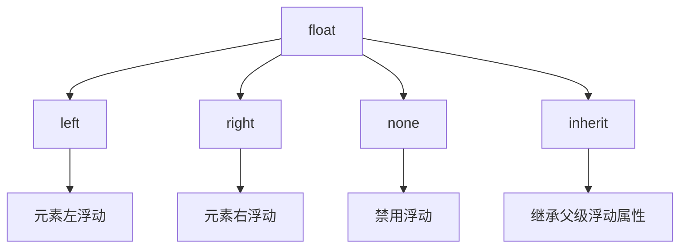
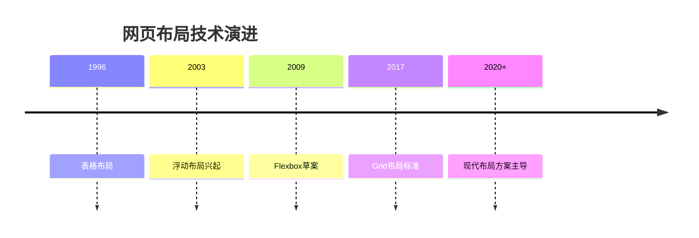

# CSS Float

## 核心概念与属性总览


---

## 基础浮动控制

### 1. 基本语法
```css
/* 图片左浮动文字环绕 */
img {
  float: left;
  margin-right: 20px;
}

/* 右浮动元素 */
.sidebar {
  float: right;
  width: 300px;
}

/* 清除浮动 */
.clearfix::after {
  content: "";
  display: table;
  clear: both;
}
```

### 2. 浮动特性
| 特性                | 描述                          |
|---------------------|-------------------------------|
| 脱离文档流          | 元素脱离正常流，其他内容环绕    |
| 块级格式化上下文     | 浮动元素创建新的BFC            |
| 宽度收缩            | 未指定宽度时自动收缩到内容宽度  |
| 行框收缩            | 相邻行内元素会避开浮动元素      |

---

## 清除浮动技术

### 1. 清除方法对比
| 方法                | 优点                      | 缺点                      |
|---------------------|---------------------------|---------------------------|
| 空div清除法         | 简单直接                  | 增加冗余标签               |
| overflow清除法      | 代码简洁                  | 可能隐藏内容或触发滚动条    |
| 伪元素清除法        | 语义化最佳实践            | 需要额外CSS代码            |
| display: flow-root  | 现代解决方案              | 兼容性要求（IE不支持）      |

### 2. 最佳清除方案
```css
/* 现代 clearfix */
.clearfix::after {
  content: "";
  display: block;
  clear: both;
}

/* 兼容旧浏览器的 clearfix */
.clearfix {
  zoom: 1; /* 触发IE hasLayout */
}
```

---

## 高级浮动应用

### 1. 多列布局
```css
.column {
  float: left;
  width: 31.33%;
  margin: 0 1%;
  box-sizing: border-box;
}

@media (max-width: 768px) {
  .column {
    float: none;
    width: auto;
    margin: 10px 0;
  }
}
```

### 2. 图文混排优化
```css
.article {
  overflow: hidden; /* 创建BFC */
}

.article img {
  float: left;
  shape-outside: circle(50%); /* 文字环绕形状 */
  margin-right: 20px;
}
```

### 3. 浮动导航菜单
```css
.nav {
  overflow: hidden;
  background: #f5f5f5;
}

.nav-item {
  float: left;
  padding: 15px 20px;
  border-right: 1px solid #ddd;
}

.nav-item:last-child {
  float: right;
  border-right: none;
}
```

---

## 现代替代方案

### 1. Flexbox 布局
```css
.flex-container {
  display: flex;
  gap: 20px;
}

.flex-item {
  flex: 1;
}
```

### 2. Grid 布局
```css
.grid-container {
  display: grid;
  grid-template-columns: repeat(3, 1fr);
  gap: 1rem;
}
```

### 3. 布局优先级建议
```markdown
1. Grid → 二维复杂布局  
2. Flexbox → 一维布局  
3. Float → 文字环绕/旧版支持
```

---

## 实用案例集合

### 案例1：媒体对象布局
```css
.media {
  overflow: hidden;
}

.media-img {
  float: left;
  margin-right: 20px;
}

.media-content {
  overflow: hidden;
}
```

### 案例2：首字下沉效果
```css
.drop-cap::first-letter {
  float: left;
  font-size: 3em;
  line-height: 0.8;
  margin: 0 5px 0 0;
}
```

### 案例3：价格标签布局
```css
.price-tag {
  border: 1px solid #ddd;
  padding: 10px;
}

.price {
  float: right;
  color: #c00;
  font-weight: bold;
}

.product-name {
  overflow: hidden;
}
```

---

## 最佳实践规范

### 1. 浮动使用准则
- 始终为浮动元素设置宽度
- 及时清除父容器的浮动
- 优先考虑现代布局方案
- 使用 `box-sizing: border-box`

### 2. 性能优化建议
- 避免深层嵌套浮动
- 使用 `will-change` 优化复杂动画
- 限制浮动元素数量（一般不超过3层）

### 3. 可访问性指南
```html
<!-- 正确语义化 -->
<div class="clearfix">
  
  <p>描述文字...</p>
</div>
```

---

## 浏览器兼容方案

### 1. 旧版IE兼容
```css
/* 触发hasLayout */
.float-container {
  zoom: 1;
}

/* IE6双边距bug修复 */
.ie6-float-fix {
  display: inline;
}
```

### 2. 移动端适配
```css
@media (max-width: 480px) {
  .float-column {
    float: none;
    width: 100%;
  }
}
```

### 3. 兼容性速查表
| 浏览器      | float支持 | clearfix兼容 |
|------------|-----------|--------------|
| Chrome     | 全支持     | 全支持        |
| Firefox    | 全支持     | 全支持        |
| Safari     | 全支持     | 全支持        |
| IE8+       | 支持       | 需zoom触发   |
| Edge       | 全支持     | 全支持        |

---

## 常见问题解决方案

### 问题1：父容器高度塌陷
```html
<!-- 解决方案：clearfix -->
<div class="clearfix">
  <div class="float-left"></div>
</div>
```

### 问题2：浮动元素换行
```css
/* 添加足够宽度 */
.float-box {
  width: 30%;
  margin: 1%;
  box-sizing: border-box;
}
```

### 问题3：文字环绕间隙
```css
img {
  float: left;
  margin-right: 20px;
  shape-outside: margin-box; /* 控制文字环绕形状 */
}
```

---

## 历史与现代演进

### 1. 浮动布局发展史


### 2. 现代替代属性
```css
/* 文字环绕新方案 */
.shape-wrap {
  display: flow-root;
  shape-outside: circle(50%);
}
```

### 3. 渐进增强策略
```css
/* 基础浮动布局 */
.legacy-layout {
  float: left;
  width: 50%;
}

/* 现代覆盖 */
@supports (display: grid) {
  .legacy-layout {
    float: none;
    width: auto;
  }
}
```