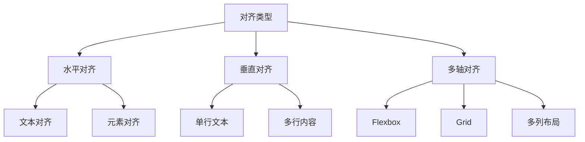

# CSS 对齐

## 核心对齐方式总览


---

## 基础对齐技术

### 1. 文本对齐
| 属性                  | 效果                      | 适用场景            |
|-----------------------|---------------------------|--------------------|
| `text-align`          | 水平对齐文本内容          | 段落、标题          |
| `vertical-align`      | 行内/表格单元格垂直对齐    | 图标、表格内容      |
| `direction`           | 文本方向                  | RTL语言支持         |

```css
/* 基础文本对齐 */
.center-text {
  text-align: center;
  direction: ltr; /* left-to-right */
}

.table-cell {
  vertical-align: middle;
}
```

### 2. 传统布局对齐
| 方法                | 实现方式                  | 缺点              |
|---------------------|---------------------------|-------------------|
| margin居中          | `margin: 0 auto`          | 仅水平有效        |
| 绝对定位            | `top: 50% + transform`    | 需要明确尺寸      |
| 表格布局            | `display: table-cell`     | 语义化问题        |

```css
/* 经典居中方案 */
.legacy-center {
  position: absolute;
  left: 50%;
  top: 50%;
  transform: translate(-50%, -50%);
}
```

---

## 现代布局对齐方案

### 1. Flexbox 对齐体系
```css
.flex-container {
  display: flex;
  justify-content: center;    /* 主轴对齐 */
  align-items: center;        /* 交叉轴对齐 */
  gap: 20px;                  /* 元素间距 */
}

.flex-item {
  align-self: flex-start;     /* 单个元素对齐 */
}
```

#### Flexbox 对齐属性矩阵
| 属性                | 主轴方向      | 可用值                          |
|---------------------|---------------|---------------------------------|
| `justify-content`   | 主轴          | flex-start, center, space-between |
| `align-items`       | 交叉轴        | stretch, center, baseline       |
| `align-content`     | 多行布局      | stretch, center, space-around   |

### 2. Grid 布局对齐
```css
.grid-container {
  display: grid;
  place-items: center; /* 简写属性 */
  justify-items: start;
  align-content: space-evenly;
}

.grid-item {
  justify-self: end;
  align-self: center;
}
```

#### Grid 对齐属性对照表
| 属性                | 作用范围      | 对应Flexbox属性     |
|---------------------|---------------|---------------------|
| `justify-items`     | 网格项水平    | align-items         |
| `align-items`       | 网格项垂直    | justify-content     |
| `justify-content`   | 网格容器水平  | justify-content     |
| `align-content`     | 网格容器垂直  | align-content       |

---

## 高级对齐技巧

### 1. 多列文本对齐
```css
.multi-col {
  column-count: 3;
  column-fill: balance; /* 自动平衡列高 */
  column-rule: 1px solid #ddd;
}
```

### 2. 浮动元素对齐控制
```css
.float-wrapper {
  display: flow-root; /* 创建BFC */
}

.float-left {
  float: left;
  shape-outside: circle(50%); /* 文字环绕形状 */
}
```

### 3. 绝对定位元素对齐
```css
.modal {
  position: fixed;
  inset: 0; /* 全屏定位 */
  margin: auto; /* 需要明确尺寸 */
  width: 80vw;
  height: 60vh;
}
```

---

## 响应式对齐策略

### 1. 媒体查询适配
```css
.card {
  text-align: left;
}

@media (max-width: 768px) {
  .card {
    text-align: center;
    display: flex;
    flex-direction: column;
    align-items: center;
  }
}
```

### 2. 视口单位对齐
```css
.hero-section {
  min-height: 100vh;
  display: flex;
  align-items: center;
}
```

### 3. 容器查询对齐
```css
@container (width > 600px) {
  .profile {
    grid-template-columns: 200px 1fr;
    align-items: start;
  }
}
```

---

## 特殊场景解决方案

### 1. 垂直居中多行文本
```css
.multiline-center {
  display: flex;
  flex-direction: column;
  justify-content: center;
  height: 200px;
}
```

### 2. 底部对齐布局
```css
.footer-layout {
  display: grid;
  min-height: 100vh;
  grid-template-rows: 1fr auto; /* 内容区自动撑开 */
}
```

### 3. 基线对齐优化
```css
.icon-text-group {
  display: inline-flex;
  align-items: baseline;
  gap: 8px;
}
```

---

## 最佳实践与规范

### 1. 现代布局优先级
```markdown
1. Grid → 二维复杂对齐  
2. Flexbox → 一维对齐  
3. 传统方法 → 简单场景/兼容需求
```

### 2. 可访问性指南
```css
.visually-hidden {
  position: absolute;
  clip: rect(0 0 0 0);
  width: 1px;
  height: 1px;
  margin: -1px;
}
```

### 3. 性能优化建议
- 避免深层嵌套对齐上下文
- 优先使用 `gap` 替代 margin 间距
- 使用 `will-change` 优化动画对齐

---

## 浏览器兼容方案

### 1. Flexbox 前缀处理
```css
.legacy-flex {
  display: -webkit-box;
  display: -ms-flexbox;
  display: flex;
  -webkit-box-pack: center;
      -ms-flex-pack: center;
          justify-content: center;
}
```

### 2. Grid 渐进增强
```css
.grid-fallback {
  display: flex;
  flex-wrap: wrap;
}

@supports (display: grid) {
  .grid-fallback {
    display: grid;
    grid-template-columns: repeat(3, 1fr);
  }
}
```

### 3. 兼容性速查表
| 特性              | Chrome | Firefox | Safari | Edge  |
|-------------------|--------|---------|--------|-------|
| Flexbox gap       | 84+     | 76+     | 14.1+  | 84+   |
| Grid Subgrid      | 117+    | 71+     | 16.4+  | 117+  |
| CSS Container Queries | 105+ | 110+    | 16.0+  | 105+  |

---

## 现代 CSS 新特性

### 1. 逻辑属性对齐
```css
.rtl-layout {
  margin-inline-start: auto; /* 自动右对齐 */
  text-align: end;
}
```

### 2. 内容分布属性
```css
.advanced-grid {
  align-content: space-between;
  justify-content: space-evenly;
}
```

### 3. 滚动驱动对齐
```css
@keyframes reveal {
  from { opacity: 0; transform: translateY(20px); }
  to { opacity: 1; transform: translateY(0); }
}

.scroll-animation {
  animation: reveal linear;
  animation-timeline: view();
}
```

---

## 常见问题解决方案

### 问题1：图片底部间隙
```css
.img-wrapper {
  line-height: 0; /* 消除基线对齐间隙 */
  font-size: 0;
}
```

### 问题2：Flex项目不等高
```css
.flex-equal {
  align-items: stretch; /* 默认值 */
}
```

### 问题3：Grid内容溢出
```css
.grid-scroll {
  grid-template-columns: minmax(0, 1fr); /* 约束内容 */
}
```