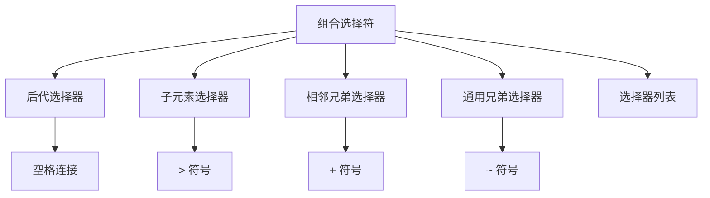
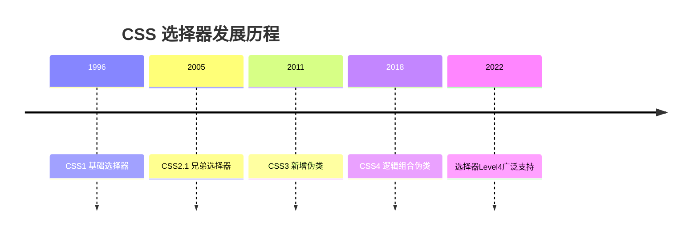

# CSS 组合选择符

## 核心概念与关系图谱


---

## 基础语法详解

### 1. 后代选择器
```css
/* 选择所有在 article 内的 p 元素 */
article p {
  color: #333;
  line-height: 1.6;
}

/* 多级嵌套示例 */
nav ul li a {
  padding: 8px 12px;
}
```

### 2. 子元素选择器
```css
/* 只选择直接子元素 */
.list > li {
  border-bottom: 1px solid #ddd;
}

/* 混合嵌套使用 */
section > article > h2 {
  font-size: 1.5em;
}
```

### 3. 相邻兄弟选择器
```css
/* 紧接在 h1 后的第一个段落 */
h1 + p {
  margin-top: 0;
  font-weight: bold;
}

/* 表单元素组合 */
input[type="text"] + button {
  margin-left: 10px;
}
```

### 4. 通用兄弟选择器
```css
/* h2 之后所有同级段落 */
h2 ~ p {
  text-indent: 2em;
}

/* 动态内容匹配 */
.alert ~ .content {
  filter: blur(2px);
}
```

---

## 选择器特性对比
| 选择器类型        | 符号 | 匹配范围           | 性能影响 |
|-------------------|------|--------------------|----------|
| 后代选择器        | 空格 | 所有层级后代       | 较高     |
| 子元素选择器      | >    | 直接子元素         | 较低     |
| 相邻兄弟选择器    | +    | 紧接的下一个元素   | 最低     |
| 通用兄弟选择器    | ~    | 后续所有同级元素   | 中       |

---

## 组合应用技巧

### 1. 复合选择器组合
```css
/* 属性选择器组合 */
a[data-tooltip]::after {
  content: attr(data-tooltip);
}

/* 多重条件筛选 */
input[type="email"]:not([disabled]) {
  border-color: #ff9800;
}
```

### 2. 伪类嵌套使用
```css
/* 排除首项的列表样式 */
ul > li:not(:first-child) {
  margin-top: 8px;
}

/* 隔行表格样式 */
tr:nth-child(odd) + tr:nth-child(even) {
  background: #f9f9f9;
}
```

---

## 性能优化指南

### 1. 选择器效率层级

1. ID选择器 (`#id`)
2. Class选择器 (`.class`)
3. 元素选择器 (`div`)
4. 属性选择器 (`[type]`)
5. 伪类/伪元素 (`:hover`)

### 2. 避免深层嵌套
```css
/* 不推荐写法 */
body div#main .content ul li a {}

/* 优化方案 */
.content-link {
  /* 直接定义样式 */
}
```

### 3. 现代选择器优化
```css
/* 使用 :where() 降低优先级 */
:where(article, section) h2 {
  color: inherit;
}
```

---

## 浏览器兼容性
| 选择器类型       | Chrome | Firefox | Safari | IE/Edge  |
|------------------|--------|---------|--------|----------|
| 后代选择器       | ✅      | ✅       | ✅      | IE7+     |
| 子元素选择器     | ✅      | ✅       | ✅      | IE7+     |
| 相邻兄弟选择器   | ✅      | ✅       | ✅      | IE7+     |
| 通用兄弟选择器   | ✅      | ✅       | ✅      | IE7+     |
| :not() 伪类      | ✅      | ✅       | ✅      | IE9+     |

---

## 常见问题解决方案

### 问题1：样式意外覆盖
```css
/* 提升选择器特异性 */
.parent-class .target-element {
  /* 样式声明 */
}
```

### 问题2：动态内容失效
```css
/* 使用通用兄弟选择器 */
.new-item ~ .existing-item {
  border-top: 1px solid #eee;
}
```

### 问题3：渲染性能瓶颈
```html
<!-- 优化前 -->
<ul class="nested-list">
  <li><div><span>...</span></div></li> x100
</ul>

<!-- 优化后 CSS -->
.nested-item {
  /* 直接定义样式 */
}
```

---

## 历史演进
