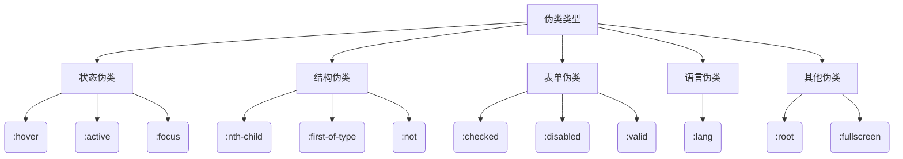

# CSS 伪类



---

## 核心概念解析

### 伪类特性矩阵
| 特性             | 描述                          | 典型应用场景          |
|------------------|-------------------------------|---------------------|
| 动态状态         | 响应用户交互                  | 按钮:hover效果       |
| 文档结构         | 基于DOM位置选择               | 表格隔行变色         |
| 表单验证         | 匹配表单状态                  | 输入框:invalid样式   |
| 逻辑组合         | 复合条件选择                  | :not(.disabled)     |

---

## 基础语法全集

### 1. 状态伪类
```css
/* 链接四态 */
a:link { color: blue; }
a:visited { color: purple; }
a:hover { 
  transform: scale(1.05);
  transition: 0.3s;
}
a:active { color: red; }

/* 输入框聚焦 */
input:focus {
  box-shadow: 0 0 5px #2196F3;
  outline: none;
}
```

### 2. 结构伪类
```css
/* 奇偶行样式 */
tr:nth-child(odd) {
  background: #f5f5f5;
}

/* 排除最后一个元素 */
li:not(:last-child) {
  border-bottom: 1px solid #ddd;
}

/* 首行文字大写 */
p::first-line {
  text-transform: uppercase;
}
```

### 3. 表单相关伪类
```css
/* 有效/无效输入 */
input:valid { border-color: #4CAF50; }
input:invalid { border-color: #f44336; }

/* 单选按钮选中状态 */
input[type="radio"]:checked + label {
  font-weight: bold;
  color: #2196F3;
}
```

---

## 高级应用模式

### 1. 复合逻辑选择
```css
/* 选择第3到第7个元素 */
li:nth-child(n+3):nth-child(-n+7) {
  background: #ffe082;
}

/* 排除禁用按钮的悬停 */
button:not([disabled]):hover {
  cursor: pointer;
  opacity: 0.9;
}
```

### 2. 动态内容交互
```css
/* 鼠标悬停显示子菜单 */
.nav-item:hover > .submenu {
  display: block;
  animation: slideDown 0.3s ease;
}

/* 聚焦时高亮相关元素 */
.input-group:focus-within {
  border: 2px solid #2196F3;
}
```

### 3. 现代布局控制
```css
/* 首个子网格项对齐 */
.grid-container:has(:first-child) {
  justify-content: start;
}

/* 空状态提示 */
.list-item:empty::before {
  content: "暂无数据";
  color: #999;
}
```

---

## 性能优化指南

### 1. 选择器效率排序

1. :not() > :nth-child() > 通用伪类
2. 避免在伪类中使用复杂属性选择器
3. 限制伪类嵌套层级（不超过3层）

### 2. 渲染优化示例
```css
/* 优化前 */
ul li:nth-of-type(2n+1) span:hover { ... }

/* 优化后 */
.list-odd-item:hover > .content { ... }
```

---

## 浏览器兼容方案

### 1. 现代伪类垫片
```html
<script src="https://cdn.polyfill.io/v3/polyfill.min.js"></script>
```

### 2. 渐进增强写法
```css
/* 基础样式 */
button { background: #eee; }

/* 现代浏览器增强 */
@supports selector(:focus-visible) {
  button:focus-visible {
    outline: 2px solid blue;
  }
}
```

### 3. 兼容性速查表
| 伪类             | Chrome | Firefox | Safari | Edge  | IE    |
|------------------|--------|---------|--------|-------|-------|
| :has()           | 105+   | 121+    | 15.4+  | 105+  | ❌     |
| :focus-visible   | 86+     | 85+     | 15.4+  | 86+   | ❌     |
| :is()            | 88+     | 78+     | 14+    | 88+   | ❌     |

---

## 开发陷阱与解决方案

### 1. 特异性冲突
```css
/* 错误：伪类增加特异性导致覆盖 */
.button:hover { color: red !important; }

/* 正确方案 */
[data-theme="dark"] .button {
  color: white;
}
.button:hover {
  color: #ff5252;
}
```

### 2. 动态状态残留
```css
/* 强制移动端点击状态清除 */
@media (hover: none) {
  :active:hover { background: transparent; }
}
```

### 3. 伪类顺序错误
```markdown
正确顺序原则：
:link → :visited → :hover → :active (LVHA顺序)
:focus 应置于 :hover 之后
```