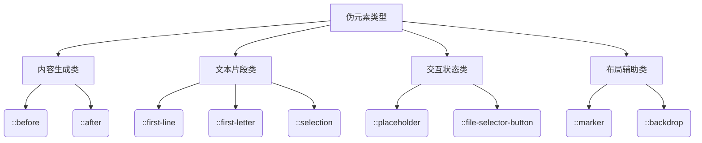

# CSS 伪元素



---

## 核心概念解析

### 伪元素特性矩阵
| 特性             | 描述                          | 典型应用场景          |
|------------------|-------------------------------|---------------------|
| 内容生成         | 通过CSS插入虚拟内容           | 装饰性图标添加       |
| 文本修饰         | 控制特定文本片段样式          | 首字母下沉效果       |
| 表单增强         | 自定义表单控件外观            | 美化文件上传按钮     |
| 布局控制         | 辅助复杂布局实现              | 列表标记样式定制     |

---

## 基础语法全集

### 1. 内容生成伪元素
```css
/* 基础内容插入 */
.tooltip::before {
  content: "提示：";
  color: #f44336;
}

/* 带属性的动态内容 */
.price::after {
  content: attr(data-currency);
  font-size: 0.8em;
}
```

### 2. 文本修饰伪元素
```css
/* 首行特殊样式 */
.article::first-line {
  font-weight: bold;
  letter-spacing: 1px;
}

/* 选中文本样式 */
::selection {
  background: #2196F3;
  color: white;
}
```

### 3. 表单控件伪元素
```css
/* 自定义输入框占位符 */
input::placeholder {
  color: #999;
  font-style: italic;
}

/* 美化文件上传按钮 */
input[type="file"]::file-selector-button {
  padding: 8px 16px;
  background: #4CAF50;
  color: white;
}
```

---

## 高级应用模式

### 1. 动画与伪元素
```css
.loader::after {
  content: "";
  display: inline-block;
  width: 20px;
  height: 20px;
  border: 3px solid #ddd;
  border-top-color: #2196F3;
  border-radius: 50%;
  animation: spin 1s linear infinite;
}

@keyframes spin {
  to { transform: rotate(360deg); }
}
```

### 2. CSS变量联动
```css
:root {
  --highlight-color: #ffeb3b;
}

.highlight::before {
  content: "";
  position: absolute;
  left: -5px;
  right: -5px;
  top: 0;
  bottom: 0;
  background: var(--highlight-color);
  z-index: -1;
}
```

### 3. 现代布局方案
```css
/* 网格布局装饰线 */
.grid::after {
  content: "";
  grid-column: 1 / -1;
  height: 2px;
  background: linear-gradient(to right, 
    transparent 20%, 
    #ddd 20%, 
    #ddd 80%, 
    transparent 80%
  );
}
```

---

## 性能优化指南

### 1. 渲染优化原则
1. 避免在伪元素中使用复杂滤镜(filter/blur)
2. 限制动画伪元素的数量（单屏不超过5个）
3. 优先使用transform替代top/left定位

### 2. 硬件加速方案
```css
.floating-effect::after {
  will-change: transform;
  transform: translateZ(0);
}
```

---

## 浏览器兼容方案

### 1. 旧版浏览器支持
```css
/* IE8兼容写法 */
.clearfix:after {
  content: ".";
  display: block;
  height: 0;
  clear: both;
  visibility: hidden;
}
```

### 2. 兼容性速查表
| 伪元素             | Chrome | Firefox | Safari | Edge  | IE    |
|--------------------|--------|---------|--------|-------|-------|
| ::before/::after   | ✅ 1.0+ | ✅ 1.5+  | ✅ 3.1+ | ✅ 12+ | IE8+  |
| ::marker           | ✅ 86+  | ✅ 68+   | ✅ 14+  | ✅ 86+ | ❌     |
| ::file-selector-button | ✅ 89+ | ✅ 64+ | ✅ 14+ | ✅ 89+ | ❌     |
| ::backdrop         | ✅ 32+  | ✅ 47+   | ✅ 13+  | ✅ 79+ | ❌     |

---

## 开发陷阱与解决方案

### 1. 内容生成限制
```css
/* 错误：忽略content属性 */
.button::before {
  /* content属性缺失将导致伪元素不显示 */
  width: 20px;
  height: 20px;
}

/* 正确方案 */
.button::before {
  content: "";
  /* 其他样式 */
}
```

### 2. 层叠上下文问题
```css
.modal::backdrop {
  /* 需要设置z-index才能覆盖其他元素 */
  position: fixed;
  z-index: 999;
  background: rgba(0,0,0,0.5);
}
```

### 3. 动态内容更新
```html
<!-- 通过data-*属性更新伪元素内容 -->
<div class="progress" data-progress="50%"></div>

<style>
.progress::after {
  content: attr(data-progress);
  /* 其他样式 */
}
</style>
```