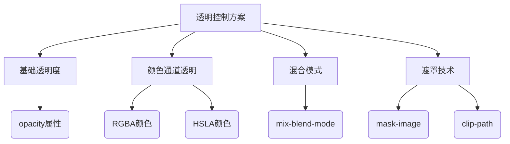
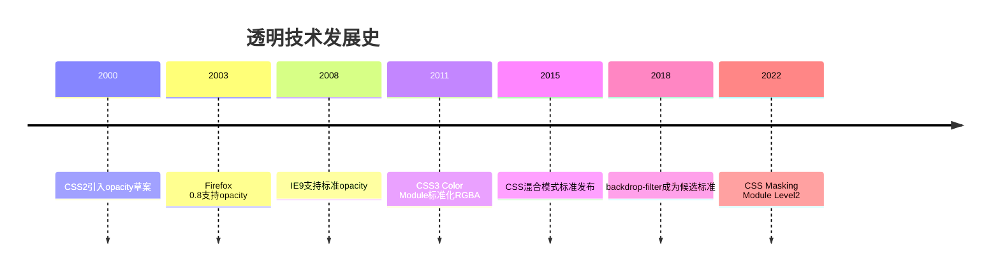

# CSS 图像透明/不透明



---

## 核心概念解析

### 透明技术对比矩阵
| 方法               | 作用范围         | 继承性 | 可动画 | 性能影响 |
|--------------------|------------------|--------|--------|----------|
| opacity            | 元素整体         | 是     | 支持   | 低       |
| RGBA/HSLA          | 颜色相关属性     | 否     | 支持   | 最低     |
| mix-blend-mode     | 元素混合区域     | 否     | 支持   | 高       |
| mask-image         | 元素可见区域     | 否     | 支持   | 中       |

---

## 基础语法全集

### 1. 全局透明度控制
```css
/* 基础透明度应用 */
.overlay {
  opacity: 0.8;
  transition: opacity 0.3s ease;
}

/* 悬停时完全显示 */
.thumbnail:hover {
  opacity: 1;
  cursor: pointer;
}
```

### 2. 颜色通道透明
```css
/* 半透明背景色 */
.modal {
  background: rgba(0, 0, 0, 0.75);
  box-shadow: 0 0 15px rgba(255, 255, 255, 0.2);
}

/* 渐变透明效果 */
.glass-effect {
  background: linear-gradient(
    to right,
    hsla(0, 0%, 100%, 0.25),
    hsla(0, 0%, 100%, 0.05)
  );
  backdrop-filter: blur(10px);
}
```

### 3. 高级混合模式
```css
/* 图像叠加效果 */
.banner img {
  mix-blend-mode: multiply;
  opacity: 0.9;
}

/* 文字穿透效果 */
.overlay-text {
  mix-blend-mode: difference;
  color: white;
}
```

---

## 高级应用模式

### 1. 动态透明控制
```css
:root {
  --glass-opacity: 0.9;
}

.glass-container {
  background: rgba(255, 255, 255, var(--glass-opacity));
  transition: background 0.5s;
}

@media (prefers-color-scheme: dark) {
  .glass-container {
    --glass-opacity: 0.85;
  }
}
```

### 2. 复合透明效果
```css
/* 半透明边框方案 */
.transparent-border {
  border: 10px solid hsla(0, 0%, 100%, 0.3);
  position: relative;
  background: rgba(0, 0, 0, 0.5);
}

/* 修复背景渗透问题 */
.transparent-border::after {
  content: "";
  position: absolute;
  top: -10px;
  left: -10px;
  right: -10px;
  bottom: -10px;
  background: inherit;
  z-index: -1;
}
```

### 3. 遮罩技术应用
```css
/* SVG图像遮罩 */
.icon-mask {
  mask-image: url('mask.svg');
  mask-size: contain;
  background-color: #2196F3;
}

/* 动态渐变遮罩 */
.text-fade {
  mask-image: linear-gradient(
    to bottom,
    transparent 5%,
    black 20%,
    black 80%,
    transparent 95%
  );
}
```

---

## 性能优化指南

### 1. 渲染性能层级

1. RGBA/HSLA > opacity > mix-blend-mode
2. 避免在大面积元素使用backdrop-filter
3. 对静态元素使用will-change: opacity


### 2. 硬件加速方案
```css
.animated-opacity {
  transform: translateZ(0);
  will-change: opacity;
  transition: opacity 0.3s cubic-bezier(0.4, 0, 0.2, 1);
}
```

---

## 浏览器兼容方案

### 1. 旧版浏览器支持
```css
/* IE8兼容方案 */
.ie8-transparency {
  filter: alpha(opacity=50); /* 0-100范围 */
  background: transparent;
  -ms-filter: "progid:DXImageTransform.Microsoft.gradient(startColorstr=#7F000000,endColorstr=#7F000000)";
}
```

### 2. 兼容性速查表
| 特性               | Chrome | Firefox | Safari | Edge  | IE    |
|--------------------|--------|---------|--------|-------|-------|
| opacity            | ✅ 1.0+ | ✅ 1.0+  | ✅ 1.2+ | ✅ 12+ | IE9+  |
| RGBA               | ✅ 1.0+ | ✅ 3.0+  | ✅ 3.1+ | ✅ 12+ | IE9+  |
| mix-blend-mode     | ✅ 41+  | ✅ 32+   | ✅ 8+   | ✅ 79+ | ❌     |
| backdrop-filter    | ✅ 76+  | ✅ 103+  | ✅ 14+  | ✅ 17+ | ❌     |

---

## 开发陷阱与解决方案

### 1. 透明度继承问题
```css
/* 错误：子元素继承不透明度 */
.parent {
  opacity: 0.5;
}
.child {
  /* 实际不透明度变为0.5 * 1 = 0.5 */
}

/* 解决方案：使用RGBA背景色 */
.parent {
  background: rgba(0, 0, 0, 0.5);
}
.child {
  opacity: 1;
}
```

### 2. 半透明阴影处理
```css
/* 有效半透明阴影方案 */
.card {
  box-shadow: 0 4px 6px hsla(0, 0%, 0%, 0.1);
  /* 替代方案：使用伪元素生成阴影 */
  position: relative;
}
.card::after {
  content: "";
  position: absolute;
  top: 10%;
  left: 5%;
  right: 5%;
  bottom: -5%;
  background: hsla(0, 0%, 0%, 0.1);
  filter: blur(10px);
  z-index: -1;
}
```

### 3. 图像格式优化

1. PNG-24：支持完整alpha通道
2. WebP：更小的文件体积
3. SVG：矢量透明图形最佳选择

---

## 历史演进路线

