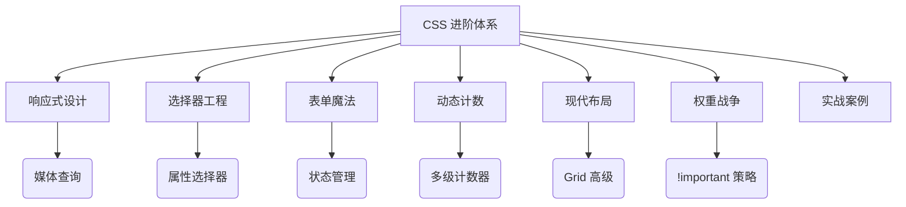
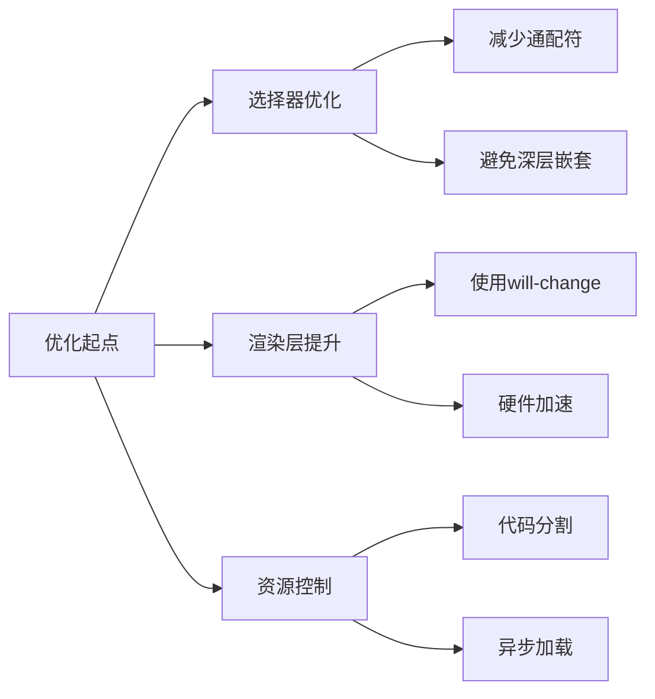

# CSS 进阶学习



---

## 第一章：媒体查询深度解析

### 1.1 现代媒体特性
```css
/* 暗黑模式适配 */
@media (prefers-color-scheme: dark) {
  body {
    background: #1a1a1a;
    color: #e0e0e0;
  }
}

/* 运动偏好优化 */
@media (prefers-reduced-motion: reduce) {
  * {
    animation: none !important;
    transition: none !important;
  }
}

/* 高对比度模式 */
@media (-ms-high-contrast: active) {
  button {
    border: 2px solid windowText;
  }
}
```
**代码解释：**  
- `prefers-color-scheme` 检测系统主题偏好
- `prefers-reduced-motion` 尊重用户运动敏感需求
- `-ms-high-contrast` 针对Windows高对比度模式优化

### 1.2 复合媒体条件
```css
/* 移动端横屏适配 */
@media (max-width: 768px) and (orientation: landscape) {
  .gallery {
    grid-template-columns: repeat(4, 1fr);
  }
}

/* 高分屏优化 */
@media 
  (min-resolution: 2dppx) and 
  (min-width: 1200px) {
  .logo {
    background-image: url("logo@2x.png");
  }
}
```
**最佳实践：**  
- 使用 `and` 组合多个条件
- 分辨率检测使用 `dppx` 单位更准确

---

## 第二章：属性选择器工程化

### 2.1 高级匹配模式
```css
/* 匹配结尾特定字符 */
a[href$=".pdf"]::after {
  content: "📄";
  margin-left: 5px;
}

/* 包含特定字符串 */
div[class*="col-"] {
  padding: 15px;
  border: 1px solid #ddd;
}

/* 空格分隔属性值 */
[class~="icon-"] {
  font-family: 'IconFont';
}
```
**匹配逻辑：**  
- `$=` 属性值结尾匹配
- `*=` 任意位置包含匹配
- `~=` 空格分隔单词匹配

### 2.2 属性选择器组合技
```css
/* 复杂表单验证 */
input[type="email"]:not([readonly]):invalid {
  border-color: #ff5722;
  animation: shake 0.5s;
}

/* 动态数据属性 */
[data-state="loading"] .spinner {
  display: block;
}

[data-tooltip]:hover::after {
  content: attr(data-tooltip);
  /* 工具提示样式 */
}
```
**工程化技巧：**  
- 与伪类组合实现状态管理
- 利用 `data-*` 属性实现组件通信

---

## 第三章：表单黑科技

### 3.1 现代输入控件
```css
/* 自定义范围滑块 */
input[type="range"] {
  -webkit-appearance: none;
  width: 100%;
  height: 5px;
  background: #ddd;
  border-radius: 3px;
}

input[type="range"]::-webkit-slider-thumb {
  -webkit-appearance: none;
  width: 20px;
  height: 20px;
  background: #2196F3;
  border-radius: 50%;
  cursor: pointer;
}

/* 日期选择器美化 */
input[type="date"]::-webkit-calendar-picker-indicator {
  filter: invert(0.5);
  padding: 5px;
  cursor: pointer;
}
```
**深度定制：**  
- `::-webkit-slider-thumb` 自定义滑块按钮
- `::-webkit-calendar-picker-indicator` 修改日期选择器图标

### 3.2 状态联动样式
```css
/* 禁用状态层级管理 */
fieldset:disabled {
  opacity: 0.6;
  position: relative;
}

fieldset:disabled::after {
  content: "";
  position: absolute;
  top: 0;
  left: 0;
  right: 0;
  bottom: 0;
  background: rgba(255,255,255,0.5);
  z-index: 1;
}

/* 必填字段星号标记 */
label:has(+ input:required)::after {
  content: "*";
  color: #f44336;
  margin-left: 3px;
}
```
**交互细节：**  
- 使用伪元素创建遮罩层防止误操作
- `:has()` 伪类实现反向选择（需注意兼容性）

---

## 第四章：计数器高级应用

### 4.1 多维计数系统
```css
/* 嵌套章节编号 */
.book {
  counter-reset: chapter section figure;
}

.chapter {
  counter-increment: chapter;
  counter-reset: section;
}

.chapter::before {
  content: "第" counter(chapter, upper-roman) "章 ";
}

.section {
  counter-increment: section;
  counter-reset: figure;
}

.section::before {
  content: counter(chapter) "." counter(section) " ";
}

.figure::before {
  counter-increment: figure;
  content: "图" counter(chapter) "-" counter(figure);
  float: left;
  margin-right: 10px;
}
```
**编号逻辑：**  
- `upper-roman` 参数实现罗马数字编号
- 三级嵌套重置实现结构化编号

### 4.2 动态内容计数
```css
/* 投票计数器 */
.vote-box {
  counter-reset: votes;
}

.vote-btn:checked {
  counter-increment: votes;
}

.total-votes::after {
  content: counter(votes);
  color: #2196F3;
  font-weight: bold;
}
```
**动态更新：**  
- 通过复选框状态驱动计数器变化
- 实时显示统计结果无需JavaScript

---

## 第五章：现代布局系统

### 5.1 Grid 高级模式
```css
/* 瀑布流布局 */
.masonry {
  display: grid;
  grid-template-columns: repeat(auto-fill, minmax(300px, 1fr));
  grid-auto-rows: masonry;
  gap: 20px;
}

/* 动态轨道尺寸 */
.dashboard {
  display: grid;
  grid-template-columns: 
    [sidebar] 200px 
    [main] minmax(0, 3fr)
    [widget] fit-content(300px);
}

/* 子网格嵌套 */
.card {
  display: grid;
  grid-template-rows: subgrid;
  grid-row: span 3;
}
```
**布局革命：**  
- `masonry` 实验性属性实现瀑布流
- `fit-content()` 智能适应内容尺寸
- `subgrid` 实现完美嵌套对齐

### 5.2 Flexbox 深度应用
```css
/* 动态换行控制 */
.tags {
  display: flex;
  flex-wrap: wrap;
  gap: 10px;
}

/* 垂直居中魔法 */
.center-box {
  display: flex;
  justify-content: center;
  align-items: center;
  min-height: 100vh;
}

/* 圣杯布局 */
.holy-grail {
  display: flex;
  flex-direction: column;
  min-height: 100vh;
}

.main-content {
  flex: 1;
  display: flex;
}

.sidebar {
  width: 200px;
  order: -1;
}
```
**弹性精髓：**  
- `gap` 属性替代传统margin间距
- `order` 控制视觉顺序
- 复合flex实现经典布局

---

## 第六章：!important 战略

### 6.1 优先级管理表

| 方法                | 优先级 | 可维护性 | 使用场景               |
|---------------------|--------|----------|------------------------|
| !important          | 最高   | 低       | 紧急覆盖/第三方样式修复 |
| 内联样式            | 高     | 低       | 动态样式               |
| ID选择器            | 中高   | 中       | 关键组件               |
| 类选择器            | 中     | 高       | 常规样式               |
| 标签选择器          | 低     | 高       | 基础样式               |

### 6.2 安全覆盖方案
```css
/* 提升特异性层级 */
html body .override.selector {
  color: red !important; /* 最后防线 */
}

/* 使用 :where() 降权 */
:where(.third-party) .target {
  color: blue;
}

/* 层叠层控制 */
@layer base, override;

@layer override {
  .conflict-style {
    color: green !important;
  }
}
```
**现代解决方案：**  
- CSS Layers 管理样式优先级
- `:where()` 降低选择器权重
- 合理规划样式层叠顺序

---

## 第七章：综合实战案例

### 7.1 响应式仪表盘
```css
.dashboard {
  display: grid;
  grid-template-columns: 
    [sidebar] 240px 
    [main] minmax(0, 1fr);
  min-height: 100vh;
}

.widget-grid {
  display: grid;
  grid-template-columns: repeat(auto-fit, minmax(300px, 1fr));
  gap: 20px;
  padding: 20px;
}

@media (max-width: 1024px) {
  .dashboard {
    grid-template-columns: 1fr;
    grid-template-rows: auto 1fr;
  }
  
  .sidebar {
    grid-row: 2;
  }
}

/* 暗黑模式适配 */
@media (prefers-color-scheme: dark) {
  .dashboard {
    background: #121212;
    color: #e0e0e0;
  }
  
  .widget {
    background: #242424;
  }
}
```
**架构解析：**  
- Grid 嵌套实现复杂布局
- `auto-fit` 智能响应列数变化
- 多维度媒体查询适配不同场景

---

## 性能优化策略

