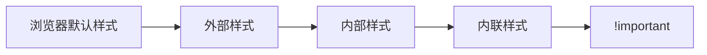

# CSS 创建与引入方式

## 核心引入方法

### 1. 内联样式（Inline Styles）
```html
<p style="color: red; font-size: 16px;">直接应用样式</p>
```
**特点**：
- ✅ 优先级最高（仅次于 `!important`）
- ❌ 难以维护，无法复用
- ⚠️ 适用场景：快速测试、覆盖第三方样式

---

### 2. 内部样式表（Embedded Styles）
```html
<head>
  <style>
    .container {
      width: 80%;
      margin: 0 auto;
    }
    /* 支持媒体查询 */
    @media (max-width: 600px) {
      .container { width: 100%; }
    }
  </style>
</head>
```
**特点**：
- ✅ 适合小型单页项目
- ❌ 无法跨页面复用
- 💡 最佳实践：将 `<style>` 放在 `<head>` 中

---

### 3. 外部样式表（External Stylesheets）
```html
<head>
  <!-- 标准引入 -->
  <link rel="stylesheet" href="styles/main.css">
  
  <!-- 媒体类型筛选 -->
  <link rel="stylesheet" href="print.css" media="print">
  
  <!-- 预加载优化 -->
  <link rel="preload" href="critical.css" as="style">
</head>
```
**特点**：
- ✅ 最佳维护性（样式与结构分离）
- ✅ 浏览器缓存优化
- 💡 文件结构示例：
  ```
  project/
  ├─ css/
  │  ├─ base.css     # 基础样式
  │  ├─ layout.css   # 布局样式
  │  └─ theme.css    # 主题样式
  ```

---

## 其他引入方式

### 1. @import 规则
```css
/* 在 CSS 文件中引入 */
@import url('reset.css');
@import 'typography.css' screen and (min-width: 768px);
```
**注意**：
- ❌ 影响加载性能（阻塞渲染）
- 💡 推荐使用 `<link>` 替代

### 2. JavaScript 动态加载
```javascript
// 动态创建 link 元素
const link = document.createElement('link');
link.rel = 'stylesheet';
link.href = 'dynamic.css';
document.head.appendChild(link);

// 移除样式
link.parentNode.removeChild(link);
```
**应用场景**：
- 按需加载主题样式
- 组件化样式管理

---

## 优先级与覆盖规则

### 加载顺序优先级


### 强制覆盖示例
```css
/* 慎用 !important */
.error {
  color: red !important;
}
```

---

## 现代开发实践

### 1. CSS 模块化
```javascript
// 配合构建工具使用（如 webpack）
import styles from './Button.module.css';

function Button() {
  return <button className={styles.primary}>点击</button>;
}
```

### 2. 关键 CSS 内联
```html
<head>
  <style>
    /* 首屏关键样式 */
    .header { ... }
    .hero { ... }
  </style>
  <!-- 异步加载非关键样式 -->
  <link rel="preload" href="non-critical.css" as="style" onload="this.rel='stylesheet'">
</head>
```

### 3. CDN 加速
```html
<!-- 引入第三方库 -->
<link rel="stylesheet" 
      href="https://cdn.jsdelivr.net/npm/bootstrap@5.3.0/dist/css/bootstrap.min.css"
      integrity="sha384-...">
```

---

## 常见错误排查

### 错误1：路径错误
```html
<!-- 错误 -->
<link rel="stylesheet" href="/wrong-folder/style.css">
```

### 错误2：属性缺失
```html
<!-- 缺少 rel 属性 -->
<link href="styles.css">
```

### 错误3：重复加载
```html
<!-- 同时存在 link 和 style -->
<link rel="stylesheet" href="theme.css">
<style>
  @import url('theme.css'); /* 重复引入 */
</style>
```

---

## 最佳实践总结
1. **生产环境使用外部样式表**
2. **关键路径 CSS 内联优化**
3. **使用预处理器管理代码**（如 Sass/Less）
4. **遵循编码规范**
   ```css
   /* 推荐 */
   .selector {
     display: block;
     margin: 0;
   }
   
   /* 避免 */
   .selector{display:block;margin:0;}
   ```
5. **性能监控**：使用 Lighthouse 检查 CSS 效率