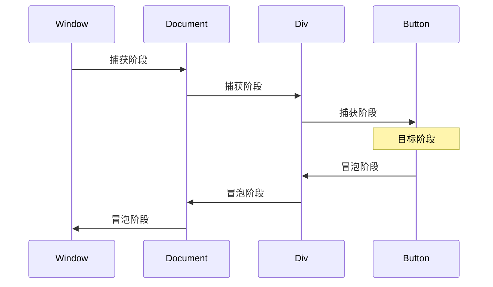

# HTML DOM 全栈开发指南

## 一、DOM 核心概念
### 1. DOM 抽象模型

### 2. 节点类型（Node Types）
| 常量                      | 值  | 说明                  |
|---------------------------|-----|-----------------------|
| `Node.ELEMENT_NODE`       | 1   | 元素节点（如 `<div>`）|
| `Node.TEXT_NODE`          | 3   | 文本节点              |
| `Node.COMMENT_NODE`       | 8   | 注释节点              |
| `Node.DOCUMENT_NODE`      | 9   | 文档根节点            |

---

## 二、节点操作技术
### 1. 节点选择器性能对比
| 方法                     | 返回类型       | 实时性   | 适用场景              |
|--------------------------|----------------|----------|-----------------------|
| `getElementById()`       | 单个元素       | 静态     | 精确ID定位            |
| `querySelector()`        | 单个元素       | 静态     | CSS选择器简单查询     |
| `getElementsByClassName`| HTMLCollection | 动态     | 类名批量操作          |
| `querySelectorAll()`     | NodeList       | 静态     | 复杂CSS选择器         |

### 2. 节点遍历方法
```javascript
// 父子关系
parent.parentNode
parent.firstElementChild
parent.lastElementChild

// 兄弟关系
node.previousElementSibling
node.nextElementSibling

// 子节点操作
parent.children // 仅元素节点
parent.childNodes // 包含所有节点类型
```

---

## 三、DOM 操作高级技巧
### 1. 高效元素创建策略
```javascript
// 传统方式（触发多次重绘）
const div = document.createElement('div');
div.textContent = 'Item';
document.body.appendChild(div);

// 文档片段优化（单次重绘）
const fragment = document.createDocumentFragment();
for(let i=0; i<100; i++){
  const div = document.createElement('div');
  fragment.appendChild(div);
}
document.body.appendChild(fragment);
```

### 2. 动态样式操作
```javascript
// 类名操作（兼容性最佳）
element.classList.add('active');
element.classList.toggle('hidden');

// 直接样式修改（慎用）
element.style.cssText = 'color: red; font-size: 20px;';
// 更优写法
element.style.setProperty('color', 'red');
element.style.removeProperty('font-size');
```

---

## 四、事件系统深度解析
### 1. 事件传播机制


### 2. 自定义事件系统
```javascript
// 创建事件
const event = new CustomEvent('build', {
  detail: { time: Date.now() },
  bubbles: true,
  cancelable: true
});

// 监听事件
document.addEventListener('build', (e) => {
  console.log('自定义事件触发:', e.detail);
});

// 触发事件
document.dispatchEvent(event);
```

---

## 五、DOM 性能优化
### 1. 重绘与回流（Reflow）控制
**触发回流的操作：**
- 修改元素几何属性（宽/高/位置）
- 调整窗口大小
- 修改默认字体
- 读取布局属性（offsetTop等）

**优化策略：**
```javascript
// 批量读取
const width = element.offsetWidth;
const height = element.offsetHeight;

// 批量写入
element.style.display = 'none';
// 执行多次DOM修改
element.style.display = 'block';
```

### 2. 事件委托模式
```javascript
document.getElementById('list').addEventListener('click', (e) => {
  if(e.target.tagName === 'LI') {
    console.log('点击项目:', e.target.textContent);
  }
});
```

---

## 六、现代 DOM 实践
### 1. 响应式数据绑定
```javascript
// 使用 Proxy 实现数据监听
const data = new Proxy({}, {
  set(target, key, value) {
    document.querySelectorAll(`[data-bind="${key}"]`).forEach(el => {
      el.textContent = value;
    });
    return Reflect.set(...arguments);
  }
});

// 触发更新
data.message = 'Hello Proxy!';
```

### 2. 虚拟 DOM 原理
```javascript
// 简化的 Diff 算法示例
function updateDOM(oldVNode, newVNode) {
  if(oldVNode.type !== newVNode.type) {
    oldVNode.el.replaceWith(createElement(newVNode));
  } else {
    const el = oldVNode.el;
    // 属性更新
    Object.keys(newVNode.props).forEach(key => {
      if(oldVNode.props[key] !== newVNode.props[key]) {
        el.setAttribute(key, newVNode.props[key]);
      }
    });
    // 子节点递归对比
    // ...
  }
}
```

---

## 七、综合应用实例
### 1. 动态表格生成器
```javascript
function createTable(data) {
  const table = document.createElement('table');
  const thead = table.createTHead();
  const tbody = table.createTBody();
  
  // 创建表头
  const headerRow = thead.insertRow();
  Object.keys(data[0]).forEach(key => {
    const th = document.createElement('th');
    th.textContent = key;
    headerRow.appendChild(th);
  });

  // 填充数据
  data.forEach(item => {
    const tr = tbody.insertRow();
    Object.values(item).forEach(value => {
      const td = tr.insertCell();
      td.textContent = value;
    });
  });

  return table;
}
```

### 2. 实时 Markdown 预览
```html
<div class="editor">
  <textarea id="input"></textarea>
  <div id="preview"></div>
</div>
<script>
document.getElementById('input').addEventListener('input', function(e) {
  const html = marked.parse(e.target.value);
  document.getElementById('preview').innerHTML = html;
});
</script>
```

---

## 八、附录：DOM 核心 API 速查
### 1. 元素操作方法
| 方法                         | 说明                          |
|------------------------------|-------------------------------|
| `element.cloneNode(true)`    | 深度克隆元素                  |
| `element.matches('selector')`| 检测是否匹配选择器            |
| `element.insertAdjacentHTML()`| 高效插入HTML片段             |

### 2. 现代 DOM API
```javascript
// 观察元素变化
const observer = new MutationObserver((mutations) => {
  mutations.forEach(mutation => {
    console.log('DOM 变更:', mutation.type);
  });
});
observer.observe(element, {
  attributes: true,
  childList: true,
  subtree: true
});

// 元素交叉观察
const io = new IntersectionObserver((entries) => {
  entries.forEach(entry => {
    entry.target.classList.toggle('visible', entry.isIntersecting);
  });
});
io.observe(element);
```

**版本说明**  
本文档内容基于 DOM Living Standard 2023，兼容现代浏览器环境