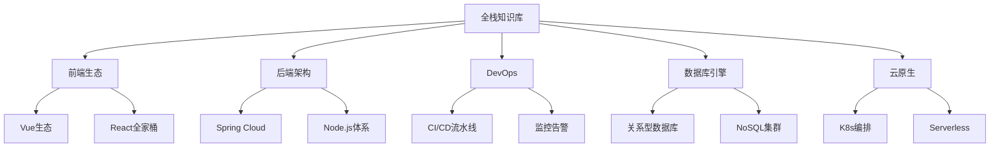

# 全栈知识库速通指南
::: info
本页内容临时使用DeepSeek-R1大模型生成！日后再人工完善！
:::

## 🗺️ 知识图谱架构


## 🚦 核心模块速查
### 1. 体系化知识库
```bash
/docs
├── frontend/         # 前端深度实践
│   ├── vue3-core     # Vue3响应式原理剖析
│   └── react-18      # Concurrent Mode实战
├── backend/          # 后端工程化
│   ├── spring-cloud  # 微服务熔断策略
│   └── nestjs        # 模块化架构设计
└── devops/           # 自动化运维
    ├── gitlab-ci     # 流水线优化方案
    └── prometheus    # 自定义Exporter开发
```

### 2. 深度原理剖析
```markdown
- 源码解析：Vue3 Diff算法实现细节 `/principle/vue-diff`
- JVM内存模型：GC算法对比 `/principle/jvm-gc`
- MySQL索引原理：B+树实战优化 `/principle/mysql-index`
```

### 3. 工程化实践
```yaml
# deploy.yml 云原生部署示例
stages:
  - build
  - test
  - deploy

k8s:
  image: registry.cn-hangzhou.aliyuncs.com/myapp:v1.2.3
  replicas: 3
  autoscaling:
    min: 2
    max: 10
```

## ⚡ 高级用法指南
### 跨模块学习路径
1. **全栈开发路线**  
   `前端鉴权方案` → `JWT后端实现` → `Nginx安全配置`

2. **性能优化闭环**  
   `Chrome Performance分析` → `MySQL慢查询优化` → `APM监控集成`

3. **微服务演进**  
   `单体应用拆分` → `Spring Cloud Gateway` → `Istio服务网格`

### 自定义配置
```js
// .knowledge/config.js
module.exports = {
  theme: 'custom-dark',  // 支持暗黑模式/学术模式
  plugins: [
    ['mermaid', { sequence: { showSequenceNumbers: true } }], // 增强图表功能
    'latex-support'      // 数学公式渲染
  ],
  externals: {
    'API文档': 'https://api.mengze.com' 
  }
}
```

## 🔧 开发工作流集成
```bash
# 使用CLI工具快速检索
mz search "分布式事务" --tag=backend --level=advanced

# 生成API文档模板
mz gen api-doc --framework=swagger --output=./docs/api

# 启动本地沙箱环境
docker-compose -f stack/sandbox.yml up
```

## 🧠 进阶资源导航
```markdown
- **延伸阅读**：
  - [Google SRE手册](链接)
  - [System Design Primer](链接)
  
- **内部秘籍**：
  - `/secret/performance-tuning-checklist` 性能调优检查表
  - `/secret/cloud-cost-optimization` 云资源成本控制

- **动态追踪**：
  - `周刊#32` WebAssembly最新进展
  - `RFC-001` 微前端标准化提案
```

> 📌 **专家提示**：使用 `Ctrl+K` 全局命令面板快速定位资源，支持模糊匹配和标签过滤